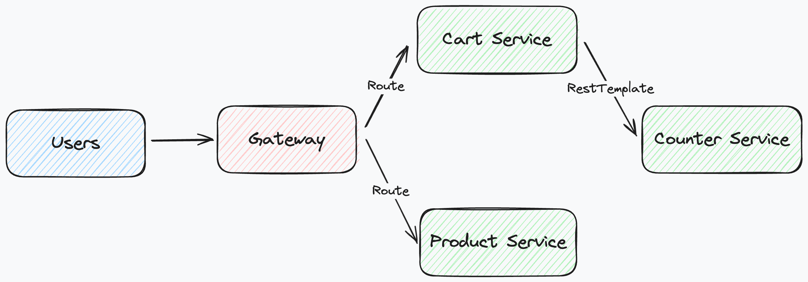

# Micro WebPoS

请参考 spring-petclinic-rest/spring-petclinic-microserivces 将 webpos 项目改为微服务架构，具体要求包括：

1. 至少包含独立的产品管理服务、订单管理服务以及 discovery/gateway 等微服务架构下需要的基础设施服务；
2. 请将系统内的不同微服务实现不同的计算复杂度，通过压力测试实验验证对单个微服务进行水平扩展（而无需整个系统所有服务都进行水平扩展）可以提升系统性能，请给出实验报告；
3. 请使用`RestTemplate`进行服务间访问，验证 Client-side LB 可行；
4. 请注意使用断路器等机制；
5. 如有兴趣可在 kubernetes 或者 minikube 上进行部署。

请编写 readme 对自己的系统和实验进行详细介绍。

## 系统介绍

这个系统是一个基于 Spring Boot 和 Spring Cloud 的 Web POS 系统，它包括了不同的微服务应用。以下是这个项目中包含的各个微服务应用和其功能的简要介绍：

1. DiscoveryServerApplication：Eureka 服务器应用，用于服务注册和服务发现。

2. ApiGatewayApplication：API 网关应用，用于统一管理和路由外部请求到不同的微服务应用。

3. CounterServiceApplication：计数器结算服务应用。

4. CartsServiceApplication：购物车服务应用，用于管理用户购物车信息，并且包含了一个负载均衡的 RestTemplate bean 用于远程调用计数器结算服务应用。

5. ProductsServiceApplication：产品服务应用，用于管理产品信息，具备 Resilience4J 断路器的功能。

项目的接口通过 `./pos-api` 下的 OpenAPI 生成

## 水平扩展测试

### 实验配置

CPU: i5-12400(6 核 12 线程)

内存: 32GB

操作系统: Ubuntu 20.04

仅对 pos-products-sevice 下的 ProductsServiceApplication 进行水平扩展测试（启动多个实例，并注册到 Eureka 服务发现）

### 实验结果

| 实例数 | 请求成功/总数 | 平均响应时间 | 95% 响应时间 | QPS     |
| ------ | ------------- | ------------ | ------------ | ------- |
| 1      | 10000/10000   | 3269ms       | 6645ms       | 555.56  |
| 2      | 10000/10000   | 2467ms       | 3896ms       | 1428.57 |
| 3      | 10000/10000   | 1583ms       | 2880ms       | 2000.00 |
